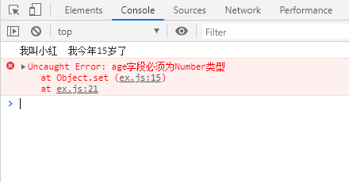

# Proxy 和 Reflect

::: tip
ES6 Proxy 和 Reflect
:::

## Proxy
```js
let xiaohong = {
    name: "小红",
    age: 15
};
xiaohong = new Proxy(xiaohong, {
    get(target, key) {
        let result = target[key];
        //如果是获取 年龄 属性，则添加 岁字
        if (key === "age") result += "岁";
        return result;
    },
    set(target, key, value) {
        if (key === "age" && typeof value !== "number") {
            throw Error("age字段必须为Number类型");
        }
        //  target[key] = value;
        //  // return 值必须为true;
        // return true;
        //可以直接搭配Reflect.set()使用
        return Reflect.set(target, key, value);
    }
});
console.log(`我叫${xiaohong.name}  我今年${xiaohong.age}了`);
// xiaohong.age = 11;
// console.log(xiaohong.age);
xiaohong.age = "aa";

```


## Reflect 
一般搭配Proxy使用
```js
//Reflect.set(target, propertyKey, value[, receiver])
//返回一个 Boolean 值表明是否成功设置属性
var obj = {};
Reflect.set(obj, "prop", "value"); // true
obj.prop; // "value"


// Reflect.getPrototypeOf()
const object1 = {
  property1: 42
};
const proto1 = Reflect.getPrototypeOf(object1);
console.log(proto1);
// expected output: [object Object]
console.log(Reflect.getPrototypeOf(proto1));
// expected output: null
```